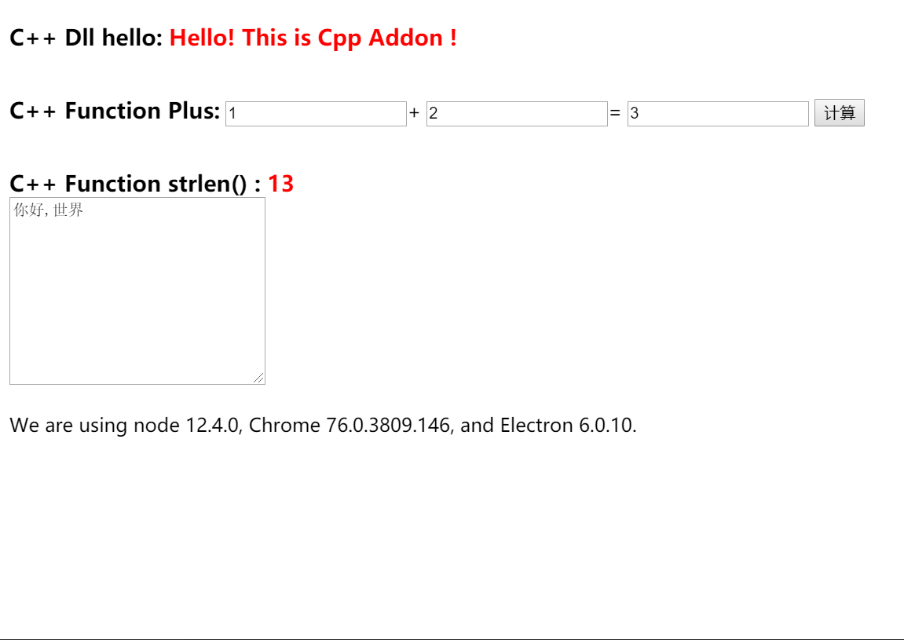

## 简介
目前使用的Node版本是 12, Electron 版本 6.0.10
npm包为 ffi-napi@2.4.5, (最早使用Electron 1.7时用的是 ffi, 但 ffi 已停止支持最新版本的Node)

## Quick Start

```bash
# dev
npm i
npm start

# build
npm run dist
```

## Build

- Use electron-builder to Build
- Add Config:
    ```js
        "extraFiles": [
            "dll"               // Where *.dll File
        ]
    ```
## ScreenShot



## `MyDLL.dll` Source Code

- cpp

```cpp
#include "stdafx.h"
#include "testdll.h"
#include <iostream>
using namespace std;
float Add(float plus1, float plus2)
{
	float add_result = plus1 + plus2;
	return add_result;
}

char *Hello()
{
	return "Hello This is Cpp Addon";
}

int StrLength(char * str)
{
	return strlen(str);
}
```

- h
```h
#pragma once
#ifndef TestDll_H_
#define TestDll_H_
#ifdef MYLIBDLL
#define MYLIBDLL extern "C" _declspec(dllimport)
#else
#define MYLIBDLL extern "C" _declspec(dllexport)
#endif
MYLIBDLL char* Hello();
MYLIBDLL float Add(float plus1, float plus2);
MYLIBDLL int StrLength(char * str);
//You can also write like this:
//extern "C" {
//_declspec(dllexport) int Add(int plus1, int plus2);
//};
#endif
```


- def

```def
LIBRARY "MyDLL"
EXPORTS
Add @1
```


## Q&A

- **MSBUILD : error MSB3428**: 未能加载 Visual C++ 组件“VCBuild.exe”。要解决此问题，1) 安装 .NET Framework 2.0 SDK；2) 安装 Microsoft Visual Stu
dio 2005；或 3) 如果将该组件安装到了其他位置，请将其位置添加到系统路径中。 [D:\electron-ffi-demo\node_modules\ref\build\binding.sln]
- `npm install --global windows-build-tools`